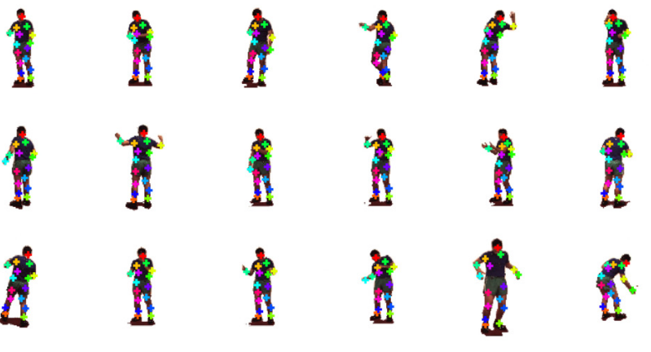

# Part-Based Unsupervised Pose Estimation 

Contact person: andreas.blattmann@iwr.uni-heidelberg.de

This repository contains our approach to part-based unsupervised keypoint reconvery. 
Here are some preliminary results on the Human3.6m dataset.




## How to run
To run the model, use the following commands:

##### Recommended way to run the model:

```
$ cd unsupervised
$ python main.py --config config.yaml --input <input_dir> --output <output_dir> --gpu <gpu_id> --mode [train/inference] 
```

If you want to resume training, start add `--restart` as an additional command line parameter.


##### Running the model using `start_ai_function.sh`:
```
$ cd unsupervised
$ bash start_ai_function.sh --software=./software --input=<path_to_dataset> --output=<path_to_output> --config=config.yaml --mode=[train/inference] --gpu <gpu_id>
```
In the `config.yaml`, you can edit basic training parameters, if this is intended. You'll also find an explanation for these parameters there.


## Dependencies

The dependencies are listed in
```
pip_requirements.txt
```

To train and test the model, create a new environment, upgrade pip and install the dependencies via
```
pip install -r pip_requirements.txt
```
from the root directory of this project.

## Data set split

Since, so far, no pose annotations are available on the KIA-data, the model was trained on three datasets availabe for research purpose only. Therefore, we cannot share the data. However, everyone actually
having access to the used datasets is invited to contact us. We will then share the respective data.

### [Human3.6m](http://vision.imar.ro/human3.6m/description.php)

The following dataset split was used within our experiments:  
- **training:**  S1,S5,S6,S7,S8,S9 
- **testing:** S11

Sx here denotes the actor with id x.

#### Future Datasets

We will also train the model on the KIA dataset, as soon as there are pose annotations available.

## Evaluation results
Results on the [Human3.6m dataset](http://vision.imar.ro/human3.6m/description.php):

 | Error w.r.t. image size | 
| :--------:|
| 2.79 | 


The weights to restore the results can be found under [https://kip.gpu-cluster.itwm.fraunhofer.de/minio/lfs-objects/TP1/AP1.5/E1.5.4_part-based_unsupervised_pose_estimation_HCI/](https://kip.gpu-cluster.itwm.fraunhofer.de/minio/lfs-objects/TP1/AP1.5/E1.5.4_part-based_unsupervised_pose_estimation_HCI/)


## Algo description
Our approach separates an input image showing a person into shape and appearance representations for each indivdual body part During inference, we can use the shape representations of the distinct body parts to estimate keypoints.
#### Overview
The model consists of three submodels. A shape stream learns a shape representation for each individual part of the human body which can be thought of as heatmap, indicating the pixels comprising the respective body part. The second submodel learns an appearance representation for each recovered body part. Finally, the third submodel is an image generator, which outputs an image based on the shape and apperance representations.

--------------------

#### Training

##### Input
The model receives two modifications of the same image as input, where the image is assumed to show a person. By using TPS-transformations, we modify the shape of the depicted person in the first input image, whereas in the second one is color-transformed, 
thus altering this person's appearance.

##### Approach

As the shape stream should learn to be invariant to appearance changes, it recovers the pixel-level shape representations `s_i`, which can be thought of as heatmaps, for each each body part `i` based on the color-transformed input image `A(x)`. Similarly, the appearance stream should 
become invariant to shape changes. Thus we use this submodel to estimate the part-appearances `a_i` based on the geometrically transformed input image `T(x)`. Based on those two inputs, the image generator is trained to reconstruct the original, untransformed image, thus promoting the appearance and shape streams towards learning the invariances. 
Moreover, we exploit the equivariance of the part-shapes under geometric transformations. Equivariance here means, that the part-shape-representations of the transformed image `s_i(T(x))` should be equal to the part-shape-representations of the original image under the same transformation `T(s_i(x))`. 
Thus, we formulate an equivariance loss which minimizes the difference of spatial means and covariances between `T(s_i(x))` and `s_i(T(x))` and, hence, helps the model in learning meaningful part-shape-representations. 

----------------

#### Inference
During inference, we estimate a two-dimensional gaussian from the part-shape-representations `s_i(x)` for a given input image `x`. A keypoint for each individual body part is then obtained from the mean of the gaussian estimated from the corresponding part-shape-representation `s_i(x)` .


-----------------------------------------------------------

More details can be found in the [original paper](https://arxiv.org/pdf/1903.06946.pdf).

-------------------------------------------

**The approach will be applied to the KIA-data as soon as pose annotations are available.**


## Updates from release to release
Put down all changes that happend from release to release regarding the algo.
- Release 2.0: Add first implementation

